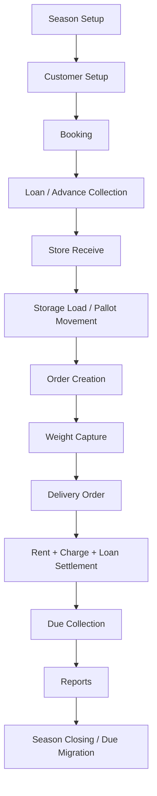
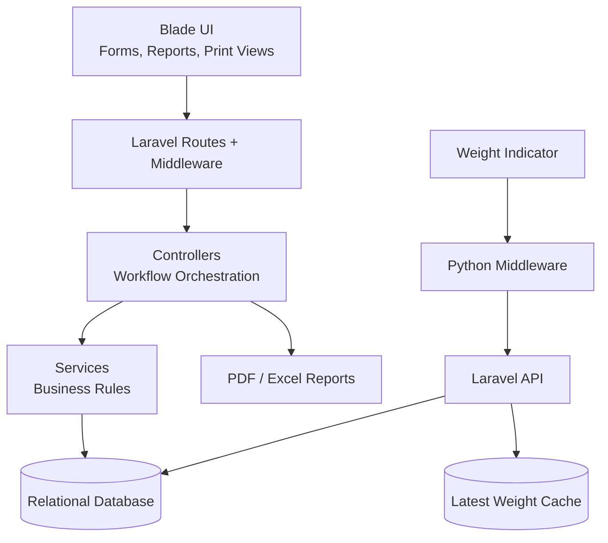

# Cold Storage ERP Case Study

## Overview

This case study documents the design and business workflow of a Cold Storage ERP
implemented as part of a larger Laravel-based enterprise application.

The system digitizes a seasonal potato cold-storage operation where customers
book storage capacity, deliver goods into storage, receive optional loan support,
move stock through physical storage locations, request delivery, weigh bags using
hardware indicators, calculate rent and charges, settle loans and dues, and
produce operational reports.

This repository is not a source-code release. It is a public engineering case
study intended to demonstrate business analysis, ERP domain modeling, database
design, architecture thinking, and integration design without exposing
proprietary implementation details.

**Target readers**

- Recruiters evaluating enterprise application experience
- Senior engineers reviewing domain and architecture decisions
- Engineering managers assessing system ownership and business understanding

## Business Domain

Cold storage is a seasonal, inventory-heavy business. The operation is not just
warehouse storage; it combines customer commitments, physical stock control,
agricultural loan support, hardware-based weight measurement, rent calculation,
delivery settlement, and management reporting.

The domain has several important characteristics:

- **Season-driven operations**: bookings, rates, stock, loans, delivery, and
  dues are tracked by season.
- **Booking-centered workflow**: booking is the primary commercial reference.
- **Store Receive as physical stock**: actual goods arrive through one or more
  SR records under a booking.
- **Location-aware storage**: stock is tracked by chamber, floor, pocket, and
  position.
- **Machine weight dependency**: actual measured weight affects delivery and
  settlement.
- **Delivery as final settlement**: delivery combines stock release, rent,
  charges, loan adjustment, collection, refund, and due creation.

## Business Workflow

Summary flow:

1. A season is configured with booking types, rates, and charges.
2. Customers create bookings for expected storage quantity.
3. Optional loan and advance collection records are created.
4. Goods arrive through Store Receive records.
5. Stock is loaded and moved through physical storage locations.
6. Delivery orders are prepared from customer requests.
7. Weight indicator data is captured and synchronized.
8. Delivery settles stock, rent, charges, loans, and dues.
9. Reports provide operational and management visibility.
10. Remaining dues or balances can be migrated during season closing.

Detailed workflow: [business-workflow.md](business-workflow.md)

## Major Modules

The public case study focuses on cold-storage-related modules and supporting ERP
infrastructure:

- Season and configuration
- Cold storage customer and account management
- Booking and agreement
- Loan and financial obligation
- Booking collection and due collection
- Store Receive
- Storage location and movement
- Order, weight, and delivery
- Rent, charge, and delivery settlement
- Cold storage reporting
- Seed stock and potato sales
- Accounting and finance integration context
- User, role, permission, and administration
- API and integration

Detailed module catalog: [modules.md](modules.md)

## High-Level Architecture

The application follows a modular monolith architecture:

Major layers:

- **UI Layer**: Blade screens, forms, reports, AJAX lookups, printable documents.
- **Controller Layer**: workflow entry points for booking, SR, storage, delivery,
  loan, collection, and reports.
- **Service Layer**: delivery validation, reserved-stock calculation, weight
  settlement, delivery synchronization.
- **Database Layer**: relational source of truth for seasonal transactions.
- **Integration Layer**: weight indicator, Python middleware, desktop sync API,
  PDF/Excel generation, mail/SMS capability.
- **Deployment Layer**: Windows/IIS style hosting with PHP runtime and local
  Python bridge where weighing hardware is installed.

Detailed architecture: [architecture.md](architecture.md)

## Technology Stack

| Area | Technology / Pattern |
| --- | --- |
| Backend | Laravel 10, PHP 8.1+ |
| UI | Blade templates, Bootstrap assets, JavaScript/AJAX |
| Database | MySQL/MariaDB-style relational schema |
| Authentication | Laravel web auth, role/permission model, Sanctum/JWT for APIs |
| Reporting | PDF and spreadsheet export libraries |
| Hardware bridge | Python serial middleware for weight indicator |
| API integration | Laravel API routes for desktop and external clients |
| Deployment | Windows/IIS style enterprise deployment with PHP FastCGI runtime |
| Auditability | Activity/log tables, login metadata, transactional history |

## Database Design

The schema is designed around core cold-storage entities rather than generic
CRUD tables.

Core entities:

- Seasons
- Customers
- Bookings
- Loans
- Store Receives
- Storage locations and movements
- Orders
- Weight data
- Delivery orders
- Due collections
- Seed stock and sale records

Key design ideas:

- Booking is the commercial anchor.
- Store Receive is the operational stock anchor.
- Weight data bridges hardware measurement and delivery settlement.
- Delivery order is both a stock movement and financial settlement record.
- Storage movement uses both history and current-state tables.
- Collections remain separate audit records.

Detailed database design: [database-design.md](database-design.md)

## Challenges & Solutions

| Challenge | Solution |
| --- | --- |
| Manual registers made real-time visibility difficult. | Centralized booking, SR, stock, delivery, collection, and reporting workflows. |
| Booked quantity and received quantity often differ. | Separate booking records from Store Receive records. |
| Stock location must be physically traceable. | Model chamber, floor, pocket, position, movement history, and current storage. |
| Delivery depends on actual bag weight. | Integrate weight indicator through Python middleware and Laravel APIs. |
| Network retries can duplicate weight data. | Use machine and desktop sync identifiers for retry-safe synchronization. |
| Delivery can over-release stock if not controlled. | Validate delivery quantity against weighted reserved stock. |
| Delivery includes stock, rent, loan, collection, and due logic. | Treat delivery as a settlement workflow, not a simple issue transaction. |
| Public documentation must avoid sensitive data. | Use conceptual entities, sanitized descriptions, and no source/database dumps. |

## Screenshots Placeholder

Screenshots can be added later only after sanitization.

Recommended placeholders:

- `screenshots/01-dashboard-sanitized.png`
- `screenshots/02-booking-form-sanitized.png`
- `screenshots/03-store-receive-sanitized.png`
- `screenshots/04-storage-location-sanitized.png`
- `screenshots/05-weight-capture-sanitized.png`
- `screenshots/06-delivery-settlement-sanitized.png`
- `screenshots/07-reporting-sanitized.png`

Screenshot rules:

- Remove company logos if confidential.
- Remove customer names, phone numbers, addresses, account numbers, and identity
  data.
- Use demo records or blurred/anonymized values.
- Do not include production URLs or internal network paths.

## Lessons Learned

- ERP success depends on understanding the real operational workflow before
  designing screens or tables.
- In cold storage, delivery is the most complex point because stock, weight,
  rent, loan, collection, and due settlement converge there.
- Hardware integration should be isolated from the ERP core through stable APIs.
- Seasonal systems need strong references and reporting boundaries.
- Current state and movement history should both be modeled when physical stock
  location matters.
- Public case studies should demonstrate architecture and business thinking
  without exposing proprietary implementation details.

## Documentation Map

| Document | Purpose |
| --- | --- |
| [business-workflow.md](business-workflow.md) | End-to-end cold storage business workflow and rules. |
| [modules.md](modules.md) | Module catalog with business purpose, tables, controllers, and rules. |
| [architecture.md](architecture.md) | Layers, request flow, integrations, weight bridge, and deployment model. |
| [database-design.md](database-design.md) | Conceptual database entities, relationships, and ER diagrams. |

## Confidentiality Notice

This case study intentionally excludes:

- Laravel source code
- Production configuration
- `.env` values
- Database dumps
- API credentials or tokens
- Company names and confidential operational figures
- Real customer, banking, identity, or uploaded document data
- Production screenshots unless fully sanitized
