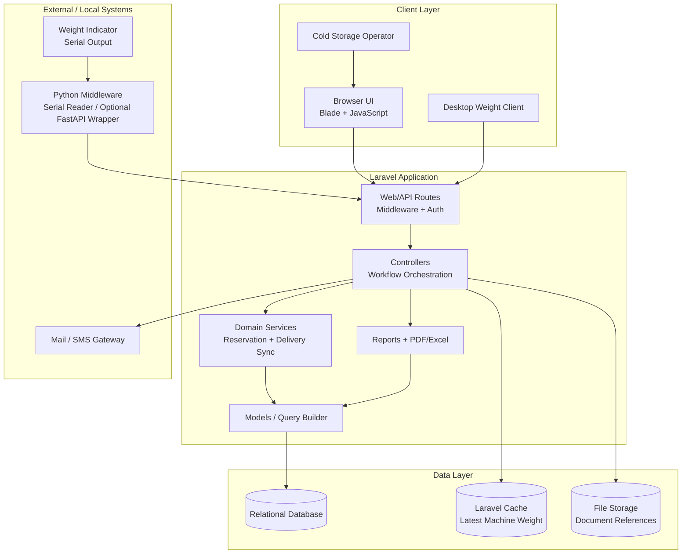
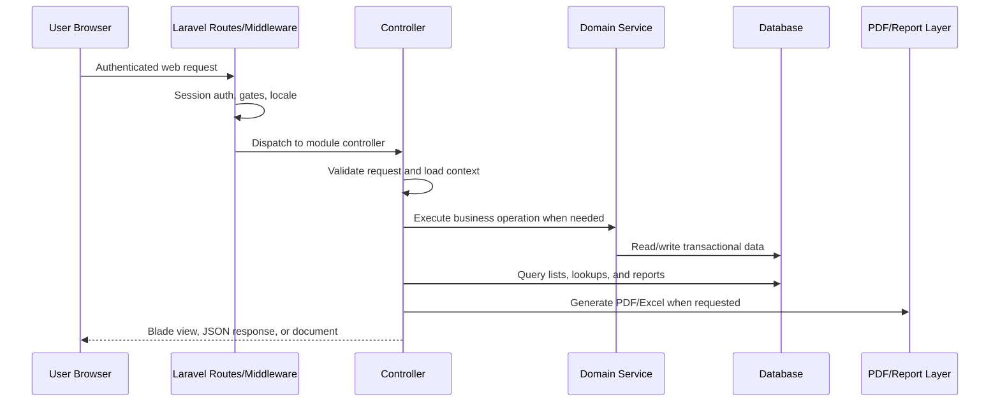
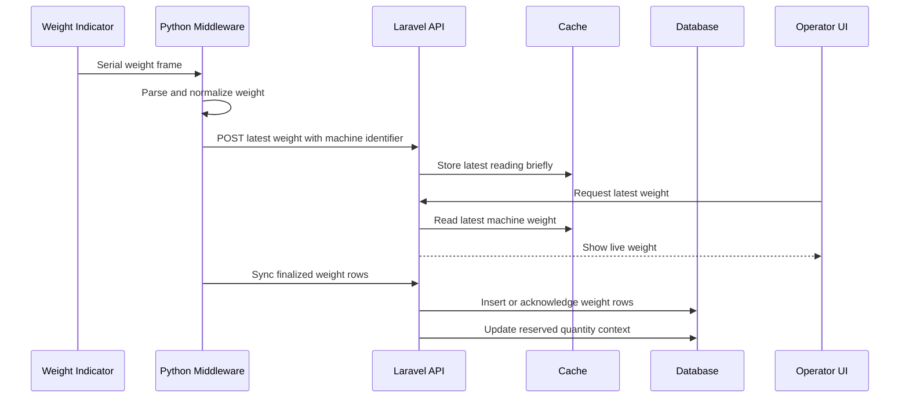
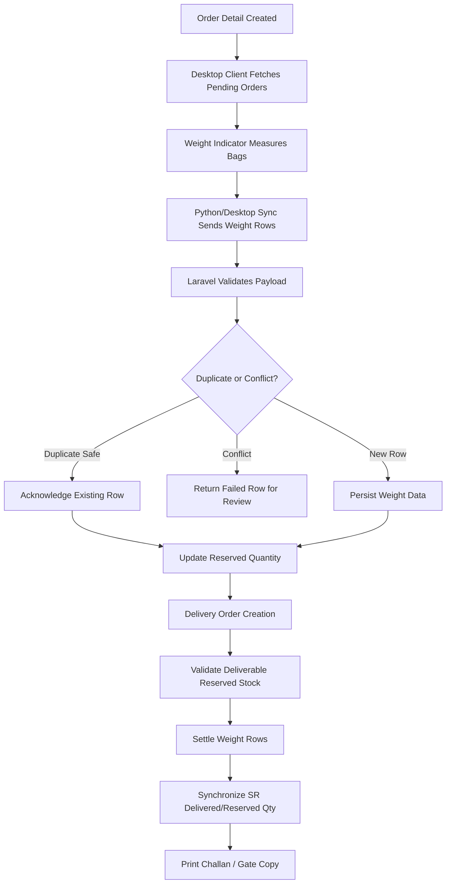
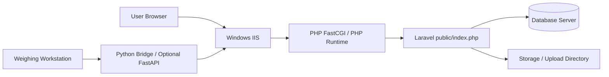

# Architecture

## Architecture Summary

The Cold Storage ERP is implemented as a Laravel-based modular monolith. The
system combines server-rendered operational screens, controller-driven business
workflows, service classes for critical stock and delivery rules, a relational
database, and external integration points for hardware weight capture and
desktop/API clients.

This document explains the architecture from an enterprise ERP perspective while
keeping proprietary source code, production URLs, credentials, company records,
and customer data outside the public case study.

## Major Layers

| Layer | Responsibility |
| --- | --- |
| UI Layer | Blade views, layouts, forms, reports, AJAX interactions, printable documents. |
| Routing and Middleware | Web/API route groups, authentication, authorization gates, locale handling, selected API throttle exceptions. |
| Laravel Controllers | Request orchestration, validation, workflow entry points, report actions, AJAX lookups, print/export endpoints. |
| Services | Business rules that need consistency, especially reservation, delivery stock sync, delivery creation/update/delete, and print generation. |
| Models and Query Layer | Eloquent models and query builder access to cold storage, finance, user, and reporting tables. |
| Database | Relational source of truth for seasons, bookings, SR, storage positions, weights, delivery, loans, collections, users, and audit records. |
| External Integrations | Weight indicator, Python bridge/middleware, desktop weight sync client, PDF/Excel libraries, mail/SMS capability, authentication tokens. |
| Deployment Runtime | Laravel on PHP under a Windows/IIS style deployment, with public web root, PHP process handler, database server, and local Python bridge where required. |

## High-Level Architecture Diagram

## Cold Storage Request Flow

Typical examples:

- Booking request flows through web routes to booking controllers, then persists
  season/customer/rate-aware booking data.
- Store Receive request links incoming stock to booking and season.
- Storage loading/pallot requests update movement history and current storage.
- Delivery requests call business services to validate weighted reserved stock,
  settle weight rows, and synchronize SR quantities.
- Reports query transactional tables and render web, PDF, or Excel output.

## Weight Integration Flow

## Delivery With Weight Flow

## UI Layer

The UI layer is primarily server-rendered through Laravel Blade templates. It is
designed for operational ERP users who need structured forms, searchable lists,
reports, and printable documents.

Key characteristics:

- Admin dashboard and module screens
- Blade layouts and reusable partials
- Form-based create/edit/show workflows
- AJAX endpoints for dependent dropdowns and search
- DataTables-style lists for operational records
- PDF/print views for booking agreements, SR documents, challans, receipts, and
  reports

The UI is treated as an operational surface, not a marketing front end.
Screens support repeated daily work: booking, receiving, loading, weighing,
delivery, collection, and reporting.

## Laravel Controllers

Controllers are the main request entry points. They coordinate user actions,
business services, database queries, and response rendering.

Important controller groups:

- Cold storage setup: season, rates, charges, chambers, floors, pockets
- Customer and booking: customer, account, target booking, agreement conditions
- Store Receive and storage movement: SR, storage load, storage pallot
- Order, weight, and delivery: order information, live weight, delivery order,
  single/manual delivery, auto delivery
- Loan and collection: loan request, loan balance, loan information, paid
  booking, due collection
- Reporting: cold storage reports and delivery reports
- API controllers: authentication, desktop weight order list, weight sync,
  market/reference APIs

Controllers act as orchestration points. Complex rules such as stock
reservation, delivery quantity validation, and weight settlement belong in
services so they can be reused and tested.

## Services

The codebase includes service classes for high-risk operational rules. This is
important because delivery and weight sync are not simple CRUD actions.

Observed service responsibilities:

- Calculate active and pending weight rows.
- Calculate reserved quantity and reserved kilograms by SR.
- Validate requested delivery quantity against available weighted reserved stock.
- Settle selected weight rows into delivery details.
- Release weights if delivery records are edited or deleted.
- Synchronize SR-level reserved and delivered quantities.
- Generate delivery numbers, parse dates, prepare manual/auto delivery data,
  print delivery documents, and handle due collection creation.

Service design direction:

- Continue moving delivery, loan settlement, rent calculation, and season close
  rules into services.
- Keep controllers thin and workflow-oriented.
- Protect delivery operations with database transactions and row locks where
  stock correctness matters.

## Database Layer

The relational database is the source of truth. It stores operational records,
financial settlement values, user/security data, and reporting history.

Major cold storage entity groups:

- Season and configuration: seasons, booking types, booking rates, charges,
  targets, agreement conditions
- Customer: cold storage customers and customer accounts
- Booking: target bookings and booking details
- Loan: loan requests, loan balances, SR loans, delivery loan adjustments
- Collection: booking collections, dues, due collections, sale collections
- Store Receive: SR records and SR-level quantity status
- Storage location: chambers, floors, pockets, positions, storage events,
  movements, current storage
- Order and weight: orders, order details, weight data
- Delivery: delivery masters, delivery details, delivery loan settlement
- Reporting/security: users, roles, permissions, activity logs, token records

Database interaction patterns:

- Controllers and reports read via Eloquent models and query builder.
- Services perform consistency-sensitive updates in transactions.
- Delivery validation locks relevant SR/weight rows to prevent over-delivery.
- Weight sync uses unique client-side identifiers where available to support
  retry-safe synchronization.
- Reports aggregate across booking, SR, weight, delivery, loan, and collection
  tables.

## External Systems

The architecture includes several external or adjacent systems:

- **Weight indicator**: physical serial device used to capture actual bag weight.
- **Python middleware**: local bridge that reads serial data and sends normalized
  readings to Laravel.
- **Desktop weight client**: authenticated client that fetches pending order
  rows and syncs finalized weight rows.
- **PDF/Excel libraries**: document generation and report export.
- **Mail/SMS services**: notification capability where configured.
- **Authentication tokens**: API access for trusted clients.
- **Windows/IIS runtime**: web server layer for enterprise deployment.

This public case study describes integration patterns without including real
endpoints, device IDs, usernames, tokens, production paths, customer records, or
environment values.

## Weight Indicator Integration

The weight indicator integration is intentionally separated from Laravel.
Laravel does not directly read the serial port. Instead:

1. A local Python process reads serial output from the weighing device.
2. The Python process parses the device-specific weight frame.
3. The middleware normalizes the value into a simple weight payload.
4. Laravel receives the value through an HTTP API.
5. Laravel stores the latest live reading in cache for short-lived UI display.
6. Finalized weight rows are persisted through authenticated sync APIs.

Business value:

- Operators can use actual measured weight in delivery settlement.
- Hardware-specific parsing stays outside the ERP core.
- Multiple weighing machines can be separated by machine identifier.
- Retry-safe sync prevents duplicate rows during network failures.

## Python / FastAPI Middleware

The production integration uses a Python serial bridge pattern rather than
coupling Laravel directly to the weighing device. In an enterprise deployment,
the bridge can be packaged in two ways:

- **Script mode**: a long-running Python process reads the serial port and posts
  readings directly to Laravel.
- **FastAPI service mode**: a local FastAPI wrapper exposes health checks,
  device status, latest local reading, and controlled sync endpoints while a
  background worker reads the serial port.

FastAPI service responsibilities in this pattern:

- Own direct serial-port access on the Windows weighing workstation.
- Provide local health/status endpoints for support teams.
- Buffer readings locally during network interruption.
- Attach stable machine and local row identifiers.
- Retry sync safely after timeout or server error.
- Keep Laravel credentials and production secrets outside public code.

## Windows IIS Deployment

The deployment target can be described as a Windows/IIS enterprise hosting
pattern:

Deployment considerations:

- IIS points the site root to Laravel's `public` directory.
- URL rewriting routes application requests to `public/index.php`.
- PHP runs through the configured IIS/PHP FastCGI runtime.
- File permissions must allow Laravel to write to `storage` and cache paths.
- Environment configuration lives outside the public repository.
- Scheduler/queue jobs, if used, should be configured through Windows Task
  Scheduler or a supervised worker process.
- The Python bridge runs on the weighing workstation or a controlled local
  service host with access to the serial device.
- Production logs, uploads, database backups, `.env`, and credentials are kept
  out of the public repository.

## Security and Access Control

Security layers observed or implied by the application:

- Web session authentication for admin users
- Authorization gates / role and permission model
- Middleware-protected admin routes
- JWT authentication for selected API clients
- Sanctum token authentication for desktop weight sync
- Login, MAC/IP, and activity logging tables
- File upload references and document storage

Public documentation scope:

The public documentation excludes real users, roles, permission exports, login
logs, MAC addresses, IP addresses, API tokens, `.env` values, uploaded
documents, and customer identity data.

## Enterprise Architecture Notes

- The modular monolith is appropriate for an ERP where modules share master data,
  users, reports, and transactions.
- The cold storage workflow is treated as a bounded domain inside the ERP.
- Delivery and weight sync are high-integrity workflows and remain
  service-driven and transaction-safe.
- Reporting reads from transactional tables without mutating operational
  state.
- External hardware integration remains outside Laravel and communicates
  through stable APIs.
- IIS deployment isolates public web files from application internals and
  protect operational storage directories.

## Challenges Solved

- Manual cold storage registers were converted into linked digital workflows.
- Machine weight capture was integrated without coupling Laravel to serial-port
  code.
- Delivery validation reduces the risk of over-delivering stock.
- Retry-safe weight sync protects data integrity during network interruption.
- Storage movement tracking gives both current location and movement history.
- Settlement combines rent, actual weight, advances, loans, dues, and documents
  in one delivery workflow.
