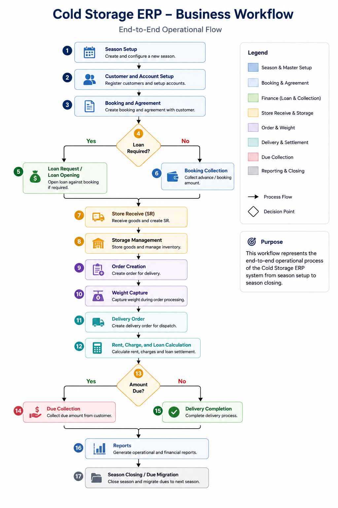
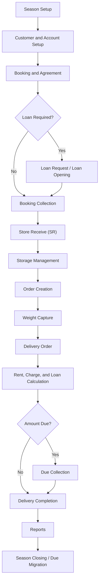

# Business Workflow

## Business Overview

The Cold Storage ERP manages a seasonal potato storage business from customer
booking through final delivery and financial settlement. The system was designed
to replace manual registers, disconnected spreadsheets, and paper challans with
a centralized workflow where every operational event is linked to the same
business references.

The real workflow is built around three core references:

- **Season**: the business period for booking, storage, delivery, dues, and
  reporting.
- **Booking**: the commercial commitment between the customer and cold storage.
- **Store Receive (SR)**: the physical receipt of potato bags into storage.

Delivery is the final operational checkpoint. It combines stock availability,
machine weight, rent, labour/fanning charges, loan balance, advance collection,
due calculation, and printed gate documents.

This workflow summary focuses on the business process while excluding company
names, production URLs, customer records, credentials, and confidential business
figures.

## Main Workflow Diagram





## 1. Season Setup

**Purpose**

Create the active business period and configure season-dependent operating
rules. Most cold storage records are grouped by season so management can track
booking, stock, loan, delivery, and collection activity for a specific crop
cycle.

**Main database tables**

- `c_s_seasons`
- `cs_booking_types`
- `cs_booking_rates`
- `cs_booking_rate_details`
- `cs_other_charges`
- `cs_business_unit_targets`
- `cs_booking_agreement_conditions`

**Important business rules**

- A season must exist before operational work can be tracked consistently.
- One season can be treated as the active/default season for daily operations.
- Booking rates, rate ranges, and charge rules are season-aware.
- Business targets can be tracked by company, season, and booking type.
- Agreement terms should be configurable so documents can change without
  changing application code.

## 2. Customer and Account Setup

**Purpose**

Maintain customer and account information used during booking, loan, delivery,
and collection. The system supports cold-storage-specific customer records in
addition to broader ERP customer data.

**Main database tables**

- `cs_customers`
- `cs_customer_accounts`
- `cs_order_customers`
- Shared ERP master data tables for company, geography, bank, and users

**Important business rules**

- Customer identity and account data must be captured before financial
  transactions can be reliably linked.
- Customer account references are used for collection and refund-related
  workflows.
- Public examples use anonymized customer names, phone numbers, account numbers,
  identity documents, addresses, and uploaded-file references.

## 3. Booking and Agreement

**Purpose**

Record the customer's storage commitment for a season. Booking is the central
commercial document and becomes the main reference for SR, loan, collection,
order, delivery, and reports.

**Main database tables**

- `cs_target_bookings`
- `c_s_bookings`
- `c_s_booking_details`
- `cs_booking_agreement_conditions`
- `cs_booking_rates`
- `cs_booking_rate_details`

**Important business rules**

- Every booking belongs to a company and season.
- A booking may reference an existing customer and can store booking-specific
  customer details for operational continuity.
- Booking type, bag quantity, rate, rate per kg, commission, and loan type drive
  later settlement logic.
- Booking numbers are treated as the primary business reference throughout the
  lifecycle.
- Booking status fields indicate whether ordering, manual delivery, or loan
  activity has already happened.

## 4. Loan Request and Loan Opening

**Purpose**

Support customers who receive financing or bag-based support connected to their
booking or stored quantity. Loans can be requested, approved, opened as balances,
assigned at SR level, and settled during delivery.

**Main database tables**

- `cs_loan_requests`
- `cs_loan_balances`
- `cs_loans`
- `sr_loans`
- `cs_do_loans`

**Important business rules**

- Loan activity depends on a booking and season.
- Loan requests may require approval before disbursement.
- Opening loan balances allow legacy or previous-period balances to be carried
  into the system.
- SR-level loan quantities and values influence delivery settlement.
- Delivery must consider outstanding loan and overdue loan balances before final
  receipt, refund, or due amount is calculated.

## 5. Booking Collection

**Purpose**

Record advance or booking-related payments before final delivery. These
collections reduce the amount due during delivery settlement and provide
management visibility into cash collection against booked storage.

**Main database tables**

- `cs_collections`
- `cs_target_bookings`
- `cs_customer_accounts`

**Important business rules**

- Collections are linked to booking and company.
- Payment date, payment mode, account reference, receivable amount, and received
  amount must be tracked.
- Advance collections should be considered during final delivery settlement.
- Collection records remain auditable while public examples exclude sensitive
  bank or account details.

## 6. Store Receive (SR)

**Purpose**

Capture the physical arrival of potato bags into the cold storage. A booking can
have multiple SR records because customers may send goods in multiple batches.

**Main database tables**

- `cs_store_receiveds`
- `cs_target_bookings`
- `sr_loans`
- `cs_storage_events`
- `cs_storage_current`

**Important business rules**

- Every SR should be linked to a booking, company, and season.
- SR number is the operational reference for stock inside storage.
- Received quantity, booking bag quantity, and loan bag quantity can differ and
  must be tracked separately.
- Reserved and delivered quantities are updated later by weight and delivery
  processes.
- SR data is the bridge between commercial booking and physical inventory.

## 7. Storage Management

**Purpose**

Track where received stock is physically stored and how it moves inside the cold
storage. The system models storage as chamber, floor, pocket, and position.

**Main database tables**

- `cs_chambers`
- `cs_floors`
- `cs_pockets`
- `cs_pocket_positions`
- `cs_storage_events`
- `cs_storage_movements`
- `cs_storage_current`

**Important business rules**

- Stock loading creates a storage event for an SR.
- Pallet/pallot movement creates a movement event and updates current location.
- Current storage must reflect the latest pocket and position for each SR.
- The same SR can be split across multiple pockets or positions.
- Movement history should be preserved for audit and operational lookup.
- Current storage enforces uniqueness by SR, pocket, and position to avoid
  duplicate current-location rows.

## 8. Order Creation

**Purpose**

Create the delivery intent before final delivery order generation. Order records
identify which SRs and bag quantities are being prepared for weighing and
delivery.

**Main database tables**

- `cs_orders`
- `cs_order_details`
- `cs_store_receiveds`
- `cs_target_bookings`
- `cs_order_customers`

**Important business rules**

- An order belongs to a company and contains one or more SR-level details.
- Order detail stores requested bag quantity and available stock quantity.
- Only order details not already sent/done for delivery should remain available
  for weighing and delivery preparation.
- Order rows become the source list for the desktop weight workflow.

## 9. Weight Capture

**Purpose**

Capture actual bag weight before delivery settlement. Actual weight is important
because rent and delivery value can depend on measured kilograms, not only bag
count.

**Main database tables**

- `cs_weight_data`
- `cs_order_details`
- `cs_store_receiveds`
- `cs_target_bookings`

**Important business rules**

- Weight rows are linked to SR, booking, company, and order detail.
- Pending weight rows represent reserved stock until settled into delivery.
- Machine/desktop sync should be idempotent so network retries do not create
  duplicate weight rows.
- The system supports machine metadata such as machine identifier, desktop UUID,
  sync batch, and sync timestamp where enabled.
- Live weight readings can be cached by machine identifier for UI display.
- Delivery cannot consume more bags than the weighted reserved quantity
  available for an SR.

## 10. Delivery Order

**Purpose**

Finalize the release of stored goods to the customer. Delivery order creation
settles selected weight rows, updates SR-level delivered/reserved stock, and
produces operational documents such as challan and gate copy.

**Main database tables**

- `cs_delivery_order_masters`
- `cs_delivery_order_details`
- `cs_weight_data`
- `cs_store_receiveds`
- `cs_orders`
- `cs_order_details`
- `cs_do_loans`

**Important business rules**

- Delivery order has a header and one or more SR-level detail rows.
- Requested delivery quantity must not exceed deliverable weighted reserved
  quantity.
- Settled weight rows are marked as delivery-completed so they cannot be reused.
- When delivery is edited or deleted, settled weight rows and SR reserved stock
  must be synchronized.
- Delivery can be manual or generated from prepared order/weight data.
- Delivery documents support warehouse and gate operations.

## 11. Rent, Charge, and Loan Calculation

**Purpose**

Calculate the financial outcome of the delivery. This step combines storage
rent, actual weight, labour and fanning charges, advance paid, loan balance,
overdue balance, commission or rebate adjustment, received amount, refund, and
due amount.

**Main database tables**

- `cs_delivery_order_masters`
- `cs_delivery_order_details`
- `cs_do_loans`
- `cs_loan_balances`
- `sr_loans`
- `cs_collections`
- `cs_other_charges`
- `cs_booking_rate_details`

**Important business rules**

- Rent may depend on booking rate, bag quantity, rate per kg, and actual weight.
- Labour and fanning charges are configurable and can be applied during
  settlement.
- Advance collection and paid loan values reduce the payable balance.
- Outstanding loan and overdue balances must be considered before final due or
  refund is determined.
- Delivery is the main point where stock and financial settlement meet.

## 12. Due Collection

**Purpose**

Track customer payments after delivery when the delivery settlement leaves an
outstanding amount.

**Main database tables**

- `cs_credit_customer_dues`
- `cs_due_collections`
- `cs_delivery_order_masters`
- `cs_customers`

**Important business rules**

- Due records should link back to customer, company, and delivery order.
- Collection amount should reduce outstanding due.
- Due collection must remain traceable to the delivery that created the
  receivable.
- Reports should show both delivery activity and unpaid/collected amounts.

## 13. Reports

**Purpose**

Provide operational and management visibility across the season. Reports allow
teams to monitor stock, loan, delivery, collection, dues, and daily activity
without relying on manual summaries.

**Main database tables**

- `cs_target_bookings`
- `cs_store_receiveds`
- `cs_weight_data`
- `cs_delivery_order_masters`
- `cs_delivery_order_details`
- `cs_collections`
- `cs_due_collections`
- `cs_loan_balances`
- `cs_storage_events`
- `cs_storage_movements`
- `cs_storage_current`

**Important business rules**

- Reports should be filterable by company, season, customer, booking, SR, and
  date where applicable.
- Daily statements should combine operational and financial status.
- Loan recovery, party loan, booking collection, paid booking, SR, and daily
  pallet reports support different management decisions.
- Public case-study reports use sample or anonymized data.

## 14. Season Closing and Due Migration

**Purpose**

Close or transition season-level balances after delivery activity is complete.
Unresolved dues or loan balances may need to be migrated into a later season so
the business can continue tracking customer obligations.

**Main database tables**

- `c_s_seasons`
- `cs_loan_balances`
- `cs_credit_due_season_migrations`
- `cs_credit_customer_dues`
- `cs_target_bookings`

**Important business rules**

- Season closing should happen after operational review of bookings, SR stock,
  delivery, loan, and due status.
- Remaining due or loan balances should be migrated with source season, target
  season, company, customer, booking, amount, and creator reference.
- Migration should preserve traceability instead of overwriting old season data.
- Closed season data should remain available for reporting and audit.

## Supporting Workflow: Seed Stock and Sales

The project also includes a supporting stock and sale workflow for seed/potato
inventory. It is adjacent to the cold storage lifecycle but separate from the
customer storage booking workflow.

**Main database tables**

- `seed_stocks`
- `stock_movements`
- `cs_sales`
- `cs_sale_items`
- `cs_sale_collections`

**Important business rules**

- Stock movement should record source, movement type, reference, quantity, date,
  and season.
- Sales should track customer, items, bag quantity, rate, subtotal, total amount,
  cash paid, and due.
- Sale collection should be linked to the sale and customer.

## Summary of Real Business Flow

```text
Season
=> Customer
=> Booking
=> Loan
=> Booking Collection
=> Store Receive
=> Storage Management
=> Order
=> Weight Capture
=> Delivery
=> Rent Calculation
=> Due Collection
=> Reports
=> Season Closing
```

The most critical business insight is that delivery is not only a warehouse
handover. In this ERP, delivery is the point where physical stock, measured
weight, loan recovery, rent calculation, customer collection, due tracking, and
official documents are finalized together.
