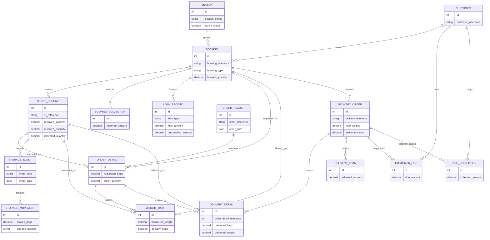
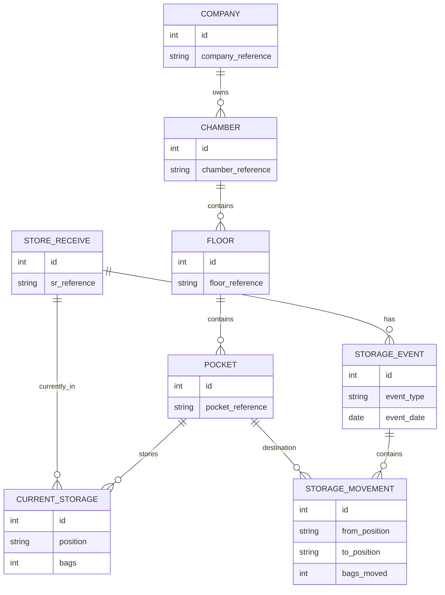
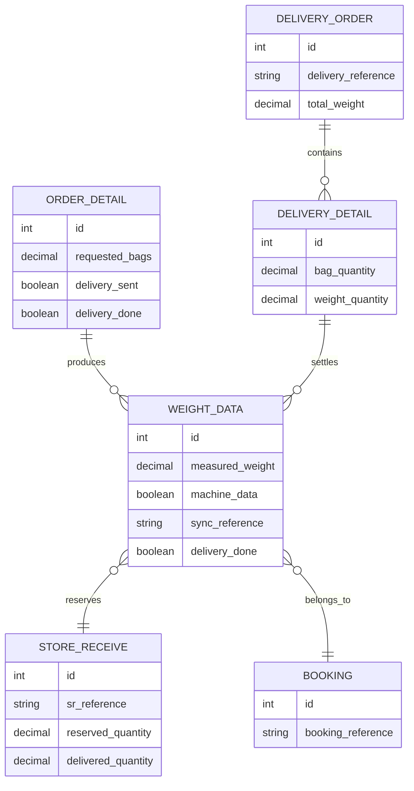

# Database Design

## Design Overview

The Cold Storage ERP uses a relational database model built around seasonal
operations. The schema connects commercial commitments, physical stock movement,
machine weight, delivery settlement, loans, and collections without publishing
sensitive customer or company information.

This document is intentionally conceptual. It does not expose every production
table or every column. Sensitive fields such as identity numbers, account
numbers, phone numbers, document paths, MAC/IP addresses, and uploaded files are
excluded from the public case study.

## Core Design Principles

- **Season controls the business period.** Most operational records are grouped
  under a season.
- **Booking is the commercial anchor.** Loan, collection, store receive, order,
  delivery, and reports connect back to booking.
- **Store Receive is the stock anchor.** SR records represent the actual goods
  received under a booking.
- **Storage location is separate from booking.** This allows the system to track
  where goods are physically stored and moved.
- **Weight data reserves stock for delivery.** Machine-captured weight rows
  become the bridge between order preparation and delivery settlement.
- **Delivery is the settlement point.** Delivery combines stock release, actual
  weight, rent, charges, loans, advances, dues, and printed documents.
- **Collections are tracked separately.** Booking collections, delivery due
  collections, and sale collections can be audited independently.

## Core Entities

## 1. Seasons

**Purpose**

Represent the operational crop/storage period. Seasons group booking rates,
bookings, store receives, loans, collections, delivery, and reports.

**Representative tables**

- `c_s_seasons`
- `cs_booking_rates`
- `cs_booking_rate_details`
- `cs_booking_types`
- `cs_other_charges`
- `cs_business_unit_targets`

**Relationship summary**

- One season has many bookings.
- One season has many booking rate configurations.
- One season can have many business targets and charge configurations.
- Season closing can migrate unresolved dues or loan balances into another
  season.

## 2. Customers

**Purpose**

Represent customers who book cold storage capacity and participate in loan,
delivery, due, and collection workflows.

**Representative tables**

- `cs_customers`
- `cs_customer_accounts`
- `cs_order_customers`

**Sensitive fields hidden**

Customer identity documents, personal contact information, bank account numbers,
and uploaded files are not documented here.

**Relationship summary**

- One customer can have many bookings.
- One customer can have many account references.
- One customer can have many dues and due collections.
- Order customer records support cases where the delivery recipient differs from
  the original booking customer.

## 3. Bookings

**Purpose**

Represent the customer's seasonal storage commitment. Booking is the primary
business reference for the cold storage lifecycle.

**Representative tables**

- `cs_target_bookings`
- `c_s_bookings`
- `c_s_booking_details`
- `cs_booking_agreement_conditions`

**Conceptual fields**

- Company reference
- Season reference
- Booking number
- Customer reference
- Booking type
- Loan type
- Booked bag quantity
- Rate and rate-per-weight configuration
- Status flags for downstream workflow

**Relationship summary**

- One booking belongs to one season.
- One booking belongs to one customer.
- One booking can have many store receives.
- One booking can have many collections.
- One booking can have many loan records.
- One booking can have many order and delivery records.

## 4. Loans

**Purpose**

Track customer financing and loan obligations connected to booking, store
receive, and delivery settlement.

**Representative tables**

- `cs_loan_requests`
- `cs_loan_balances`
- `cs_loans`
- `sr_loans`
- `cs_do_loans`
- `cs_credit_due_season_migrations`

**Conceptual fields**

- Booking reference
- Customer reference
- Season reference
- Requested, approved, disbursed, or opening amount
- Loan type
- SR-level loan quantity or amount
- Delivery adjustment amount
- Migration source and target season

**Relationship summary**

- A booking can have loan requests or loan balances.
- A store receive can have SR-level loan data.
- A delivery order can have loan settlement rows.
- Unresolved balances can be migrated between seasons.

## 5. Store Receives

**Purpose**

Represent physical receipt of customer goods into storage. Store Receive is the
operational stock reference below booking.

**Representative tables**

- `cs_store_receiveds`
- `sr_loans`

**Conceptual fields**

- Company reference
- Booking reference
- SR number
- SR date
- Season
- Received quantity
- Booking quantity
- Loan quantity
- Reserved quantity
- Delivered quantity

**Relationship summary**

- One booking can have many store receives.
- One store receive can have many storage movements.
- One store receive can have many order detail rows.
- One store receive can have many weight rows.
- One store receive can appear in many delivery detail rows.

## 6. Storage Locations

**Purpose**

Model the physical location of goods inside the cold storage facility and keep
both movement history and current stock position.

**Representative tables**

- `cs_chambers`
- `cs_floors`
- `cs_pockets`
- `cs_pocket_positions`
- `cs_storage_events`
- `cs_storage_movements`
- `cs_storage_current`

**Conceptual fields**

- Chamber, floor, pocket, and position references
- Storage event type such as load or pallet movement
- Source and destination location
- Bags moved
- Current bags by SR and position

**Relationship summary**

- One chamber has many floors.
- One floor has many pockets.
- One pocket can have many positions or current stock rows.
- One store receive can have many storage events.
- One storage event can have many storage movement rows.
- Current storage summarizes the latest stock position by SR, pocket, and
  position.

## 7. Orders

**Purpose**

Represent the delivery intent before final delivery. Orders identify which SRs
and bag quantities are being prepared for weighing and release.

**Representative tables**

- `cs_orders`
- `cs_order_details`
- `cs_order_customers`

**Conceptual fields**

- Order date
- Order number
- Company reference
- Requested bag quantity
- SR reference
- Booking reference
- Stock quantity
- Delivery sent/done status

**Relationship summary**

- One order has many order details.
- One order detail belongs to one booking and one store receive.
- One order detail can have many weight rows.
- Order details are used by the weighing workflow before delivery is completed.

## 8. Weight Data

**Purpose**

Capture actual measured weight from the weight indicator and reserve stock for
delivery.

**Representative table**

- `cs_weight_data`

**Conceptual fields**

- Store receive reference
- Booking reference
- Company reference
- Order detail reference
- Measured weight
- Delivery sent/done status
- Machine sync metadata

**Sensitive fields hidden**

Machine identifiers and desktop/local sync identifiers are described
conceptually only. Real values must never be published.

**Relationship summary**

- One order detail can have many weight rows.
- One store receive can have many weight rows.
- One booking can have many weight rows.
- Weight rows remain pending until they are settled into delivery.
- Machine and desktop identifiers support duplicate-safe synchronization.

## 9. Delivery Orders

**Purpose**

Represent final release of stored goods and financial settlement.

**Representative tables**

- `cs_delivery_order_masters`
- `cs_delivery_order_details`
- `cs_do_loans`
- `cs_do_carts`

**Conceptual fields**

- Delivery order number
- Delivery date
- Booking reference
- Company reference
- SR-level delivered quantity
- Total measured weight
- Rent and charge totals
- Loan and overdue balances
- Received amount, refund, or due amount

**Relationship summary**

- One delivery master has many delivery details.
- One delivery detail belongs to one store receive.
- One delivery can have loan adjustment rows.
- Delivery details settle selected weight rows.
- Delivery can create or update due records.

## 10. Due Collections

**Purpose**

Track outstanding amounts and later collections after delivery or sale
settlement.

**Representative tables**

- `cs_credit_customer_dues`
- `cs_due_collections`
- `cs_collections`
- `cs_sale_collections`

**Conceptual fields**

- Customer reference
- Company reference
- Delivery or sale reference
- Receivable amount
- Received amount
- Collection date
- Payment mode

**Sensitive fields hidden**

Bank account numbers, cheque details, and private customer payment data are not
included in this public design.

**Relationship summary**

- One delivery can create a customer due.
- One due can have many due collection records.
- Booking collections are linked to booking and affect settlement.
- Sale collections are linked to seed/potato sale records.

## 11. Seed Stock and Sales

**Purpose**

Support a related stock and sales workflow for seed/potato inventory.

**Representative tables**

- `seed_stocks`
- `stock_movements`
- `cs_sales`
- `cs_sale_items`
- `cs_sale_collections`

**Relationship summary**

- One stock entry can create stock movements.
- One sale has many sale items.
- One sale can have many collections.
- Stock movements preserve source, reference, date, and quantity.

## Core ER Diagram

## Storage Location ER Diagram

## Weight Sync and Delivery Relationship Diagram

## Relationship Explanation

## Season to Booking

A season owns the operational period. Bookings, rates, charges, targets, and
season migration records depend on this period. This makes seasonal reporting
and season close possible.

## Booking to Store Receive

Booking is the customer's commitment; Store Receive is the actual stock arrival.
A booking can produce multiple SR records because goods may arrive in batches.
This split allows the system to track commercial quantity and physical quantity
separately.

## Store Receive to Storage Location

An SR can be loaded and moved inside the cold storage. Storage events preserve
history, while current storage keeps the latest known position. This design
supports both audit and day-to-day warehouse lookup.

## Order to Weight Data

Orders identify what the customer wants to deliver. Weight rows record actual
bag measurements against order details. Pending weight rows act as reserved
stock for delivery.

## Weight Data to Delivery

Delivery settles selected weight rows. Once a weight row is marked as delivered,
it should not be reused in another delivery. This protects stock accuracy.

## Delivery to Loans and Dues

Delivery is the settlement point. It combines delivered stock, measured weight,
rent, charges, advance collection, loan adjustment, overdue balance, refund, and
due creation.

## Due to Due Collection

If delivery leaves an outstanding amount, a due record is created and later
reduced through due collection records. This keeps receivables traceable to the
delivery that created them.

## Why the Schema Is Designed This Way

## 1. Seasonal Business Needs

Cold storage work is seasonal. Grouping data by season allows management to
compare bookings, stock, delivery, loans, and collections for each business
cycle.

## 2. Booking and SR Are Separate

The booked quantity and the physically received quantity are not always the
same. Separating booking from Store Receive allows the system to handle partial
arrival, multiple batches, and operational stock tracking.

## 3. Storage Is a Physical Hierarchy

Chamber, floor, pocket, and position are modeled separately because warehouse
teams need to know where goods are physically located, not only who owns them.

## 4. Weight Is Its Own Entity

Actual machine weight is captured as separate rows because delivery settlement
depends on measured weight. This also supports retry-safe synchronization from
desktop/Python middleware.

## 5. Delivery Is Both Stock and Finance

Delivery releases stock, settles machine weight, applies rent and charges,
adjusts loans, records payments, and creates dues. Keeping delivery header and
detail records allows the system to summarize settlement while preserving SR
level detail.

## 6. Collections Are Independent Audit Records

Collections are modeled separately from booking and delivery so payment history
can be audited over time. This is important for advance payments, delivery dues,
and sale collections.

## 7. Movement History and Current State Both Matter

Storage movement tables preserve historical actions. Current storage provides
fast lookup for daily operations. Both are needed in a warehouse environment.

## Public-Safe Documentation Rules

- Do not publish full migrations or production schema dumps.
- Do not expose sensitive customer, banking, identity, document, machine, or
  user audit fields.
- Use conceptual names such as `customer_reference`, `booking_reference`, and
  `sync_reference` in diagrams.
- Avoid sample data copied from production.
- Keep diagrams focused on business relationships, not implementation details.
